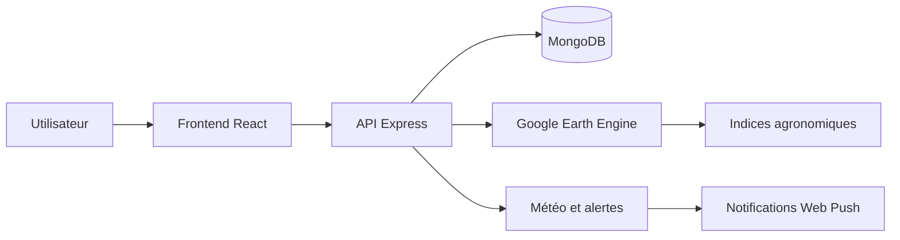
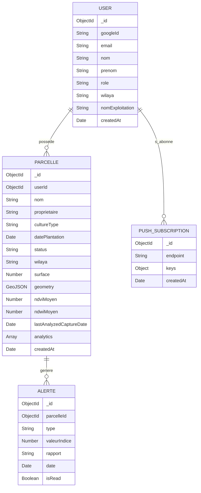

# AgriTech

<div align="center">


</div>

<p align="center">
  <strong>Plateforme intelligente de surveillance agronomique</strong><br>
  Suivi des parcelles, analyse satellitaire, alertes prédictives et dashboards décisionnels pour une agriculture plus durable.
</p>

---

##  Vision du projet

AgriTech est une plateforme web de gestion et de surveillance des parcelles agricoles, pensée pour aider les agriculteurs, gestionnaires de terres et conseillers agricoles à mieux suivre l’état de leurs cultures à partir de données satellitaires, météorologiques et de signalements intelligents.

Le projet transforme des images Sentinel-2 et des données environnementales en indicateurs exploitables pour évaluer la santé végétale, détecter les zones de stress et anticiper les risques agronomiques.

---

##  Problème métier

L’agriculture moderne manque encore d’outils simples, rapides et fiables pour :

- suivre l’état d’une parcelle en temps réel,
- mesurer la végétation à partir d’indices satellitaires,
- repérer les zones fragiles ou stressées,
- anticiper la dégradation agronomique,
- centraliser les décisions dans un seul tableau de bord.

AgriTech répond à ce besoin en transformant les images et les données environnementales en informations utiles pour la prise de décision.

---

##  Ce que fait la plateforme

- Cartographie interactive des parcelles via Leaflet
- Dessin d’une parcelle sur une carte géographique
- Calcul des indices satellitaires : NDVI, NDWI, SAVI et GNDVI
- Analyse de la santé des cultures à partir d’images Sentinel-2
- Dashboard analytique avec historiques et tendances
- Centre d’alertes automatisées
- Notifications Web Push en temps réel
- Authentification sécurisée via Google OAuth + JWT
- Export PDF / CSV des rapports de parcelle

---

##  Valeur ajoutée

AgriTech se positionne comme une solution de decision support agricole basée sur la géomatique et l’analyse de données. Il combine :

- télédétection,
- analyse agronomique,
- dashboard décisionnel,
- automatisation des alertes,
- engagement utilisateur par notifications.

L’objectif est de passer d’un suivi manuel et partiel à une supervision intelligente des exploitations agricoles.

---

##  Architecture technique

### Frontend

- React 18 + TypeScript
- Vite
- Tailwind CSS
- Shadcn UI
- React Router
- Leaflet / React Leaflet
- Chart.js / Recharts
- TanStack Query

### Backend

- Node.js + Express
- MongoDB + Mongoose
- Google Earth Engine API
- Passport.js + OAuth Google
- JWT pour sécuriser les routes
- Web Push API pour les notifications navigateur
- Services métier modulaires pour météo, alertes et analyse stress

### Flux principal



---

##  Indices agronomiques utilisés

La plateforme s’appuie sur plusieurs indices de végétation reconnus :

- NDVI : vigueur végétale et densité de couverture végétale
- NDWI : humidité du couvert végétal et stress hydrique
- SAVI : meilleure sensibilité dans les zones semi-arides et à faible couverture
- GNDVI : estimation de la chlorophylle et du statut physiologique de la culture

Cette combinaison permet une lecture plus complète de la santé agronomique d’une parcelle.

---

##  Dashboard et surveillance

Le dashboard centralise :

- nombre total de parcelles,
- NDVI moyen global,
- SAVI et GNDVI globaux selon les séries temporelles,
- alertes actives,
- stress hydrique,
- évolution temporelle des indices,
- répartition par wilaya,
- suivi de plusieurs parcelles.

Le but est de permettre une lecture rapide et claire pour mieux piloter l’exploitation.

---

##  Alertes intelligentes

Le système détecte des variations anormales dans les indices et déclenche des alertes selon les niveaux suivants :

- ok
- warning
- critical

Les alertes sont visibles dans le centre d’alertes et peuvent être diffusées via notifications navigateur pour informer l’utilisateur en temps réel.

---

##  Structure du projet

```text
projet_Fin_d_tude/
├── README.md
├── readme.premium.md
├── backend/
│   ├── app.js
│   ├── server.js
│   ├── package.json
│   ├── gee-key.json
│   ├── config/
│   │   ├── db.js
│   │   ├── passport.js
│   │   └── ...
│   ├── controller/
│   │   ├── authController.js
│   │   ├── alertController.js
│   │   ├── dashboardController.js
│   │   ├── parcelleController.js
│   │   └── pushController.js
│   ├── middleware/
│   │   └── authJwt.js
│   ├── models/
│   │   ├── Alert.js
│   │   ├── Parcel.js
│   │   ├── PushSubscription.js
│   │   └── User.js
│   ├── Routes/
│   │   ├── alertRoutes.js
│   │   ├── authApiRoutes.js
│   │   ├── authRoutes.js
│   │   ├── dashboardRoutes.js
│   │   ├── parcelleRoutes.js
│   │   └── pushRoutes.js
│   ├── services/
│   │   ├── geeAuth.js
│   │   ├── geeService.js
│   │   ├── pushService.js
│   │   ├── stressWorker.js
│   │   └── weatherService.js
│   └── utils/
│       └── oauthFrontend.js
├── frontend/
│   ├── package.json
│   ├── vite.config.ts
│   ├── tailwind.config.ts
│   ├── src/
│   │   ├── App.tsx
│   │   ├── components/
│   │   ├── contexts/
│   │   ├── features/
│   │   ├── pages/
│   │   └── ...
│   └── public/
└── LICENSE (si ajouté plus tard)
```

---

##  Modèle de données



### Relations principales

- Un utilisateur possède plusieurs parcelles.
- Une parcelle peut générer plusieurs alertes.
- Le système stocke aussi les abonnements Web Push pour envoyer des notifications navigateur.

---

##  API principale

La plateforme expose une API REST backend structurée autour de plusieurs modules : authentification, gestion des parcelles, alertes, dashboard et notifications push.

### Authentication

- `GET /auth/google` — démarrage du flux OAuth Google
- `GET /auth/google/callback` — callback Google après authentification
- `GET /api/auth/me` — récupération du profil utilisateur connecté
- `PATCH /api/auth/me` — mise à jour du profil utilisateur

### Parcelles

- `POST /api/parcelles` — création d’une parcelle
- `GET /api/parcelles` — liste des parcelles de l’utilisateur connecté
- `GET /api/parcelles/:id` — détails complets d’une parcelle
- `GET /api/parcelles/:id/serie-temporelle` — série temporelle NDVI/NDWI
- `GET /api/parcelles/:id/meteo` — données météorologiques
- `POST /api/parcelles/:id/analyze-stress` — analyse de stress agronomique
- `PUT /api/parcelles/:id` — modification d’une parcelle
- `DELETE /api/parcelles/:id` — suppression d’une parcelle

### Alertes

- `GET /api/alertes` — liste des alertes de l’utilisateur
- `PATCH /api/alertes/:id/read` — marquer une alerte comme lue
- `DELETE /api/alertes/:id` — supprimer une alerte précise
- `DELETE /api/alertes` — supprimer les alertes lues

### Dashboard

- `GET /api/dashboard/stats` — statistiques globales
- `GET /api/dashboard/serie` — série historique des indicateurs
- `GET /api/dashboard/status-distribution` — distribution des statuts des parcelles
- `GET /api/dashboard/wilayas` — répartition des parcelles par wilaya

### Notifications push

- `POST /api/push/subscribe` — abonnement aux notifications Web Push
- `POST /api/push/unsubscribe` — désinscription des notifications

### Système

- `GET /api/health` — vérification du backend et état de la base

---

##  Stack technique


---

##  Installation et démarrage

### 1. Cloner le projet

```bash
git clone https://github.com/TON_UTILISATEUR/agritech.git
cd agritech
```

### 2. Installer les dépendances backend

```bash
cd backend
npm install
```

### 3. Configurer les variables d’environnement

Copie le fichier d’exemple :

```bash
cp .env.example .env
```

Puis renseigne les valeurs nécessaires dans `.env` :

```env
PORT=5000
MONGO_URI=mongodb://localhost:27017/agri
FRONTEND_URL=http://localhost:8080
JWT_SECRET=xxxxxxxxxxxxxxxxxxxxxxxxx
GOOGLE_CLIENT_ID=votre_google_client_id
GOOGLE_CLIENT_SECRET=votre_google_client_secret
GOOGLE_CALLBACK_URL=http://localhost:5000/api/auth/google/callback
VAPID_SUBJECT=mailto:admin@example.com
VAPID_PUBLIC_KEY=votre_vapid_public_key
VAPID_PRIVATE_KEY=votre_vapid_private_key
INDICES_STABILITY_THRESHOLD=0.05
INDICES_DEGRADATION_THRESHOLD=0.10
```

> Le fichier `gee-key.json` ou les identifiants Google Earth Engine doivent également être configurés selon la méthode d’authentification adoptée par le projet.

### 4. Installer les dépendances frontend

```bash
cd ../frontend
npm install
```

### 5. Lancer les applications

Backend :

```bash
cd ../backend
npm run dev
```

Frontend :

```bash
cd ../frontend
npm run dev
```

### 6. Accès local

- Frontend : http://localhost:5173
- Backend API : http://localhost:5000
- Health check : http://localhost:5000/api/health

---

##  Cas d’usage

La plateforme convient à :

- agriculteurs individuels,
- gestionnaires de grands périmètres agricoles,
- conseillers agronomes,
- entreprises de conseil rural,
- organisations souhaitant digitaliser le suivi de leurs parcelles.

---

##  Impact attendu

AgriTech vise à améliorer :

- la surveillance des exploitations agricoles,
- l’anticipation des risques agronomiques,
- la qualité des décisions agronomiques,
- la réduction du gaspillage et du stress hydrique,
- la valorisation des données spatiales dans le secteur agricole.

---

##  Roadmap

- intégration de modèles IA pour prévision de rendement,
- recommandations agronomiques personnalisées,
- multi-rôles utilisateurs (admin, agriculteur, conseiller),
- intégration de capteurs IoT,
- analyses avancées et reporting automatique,
- extension à plusieurs régions / wilayas.

---

##  Pourquoi ce projet est fort

Ce projet allie innovation technologique, impact social et application concrète dans le secteur agricole. Il illustre parfaitement un produit numérique capable de transformer les données spatiales en décisions utiles et concrètes.

C’est une solution qui montre à la fois :

- les compétences techniques en full stack,
- la capacité à travailler sur des problèmes réels,
- la compréhension des enjeux de la transition agricole numérique.

---

##  À propos du projet

Ce projet a été conçu dans le cadre d’un projet de fin d’études, avec l’objectif de démontrer qu’il est possible d’utiliser les technologies web, la télédétection et l’analyse de données pour moderniser le secteur agricole.

---

##  Conclusion

AgriTech n’est pas seulement une application de surveillance de parcelles ; c’est une solution de gestion intelligente agricole pensée pour mieux piloter les exploitations, anticiper les risques et favoriser une agriculture plus durable.

> Une plateforme data-driven pour la culture de demain.

---

<p align="center">
  <strong>Projet de fin d’études • AgriTech • Agriculture intelligente • Analyse satellitaire • Décision support agricole</strong>
</p>
