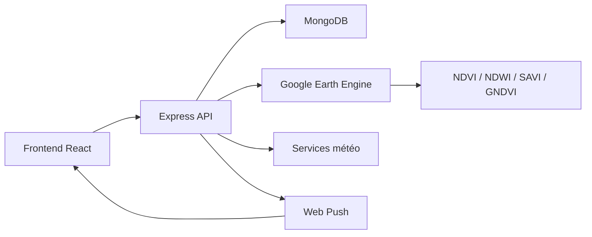

# AgriTech Backend

Le backend d’AgriTech est la couche API qui pilote la logique métier, la sécurité, le stockage MongoDB, le calcul satellitaire via Google Earth Engine, les alertes et les notifications Web Push.

Il sert de moteur central entre :

- le frontend React,
- les données géospatiales des parcelles,
- les indices végétaux calculés sur des images Sentinel-2,
- la base MongoDB,
- les utilisateurs authentifiés via Google OAuth et JWT.

---

## 1. Objectif du service backend

Le backend a pour rôle de :

- authentifier les utilisateurs,
- sécuriser les routes avec JWT,
- gérer les parcelles agricoles et leurs géométries,
- calculer et stocker les séries temporelles d’indices (NDVI, NDWI, SAVI, GNDVI),
- détecter les anomalies agronomiques,
- émettre des alertes selon des seuils métier,
- envoyer des notifications push au navigateur,
- exposer une API REST orientée pour le tableau de bord et l’application frontend.

---

## 2. Stack technique

- Node.js
- Express.js
- MongoDB + Mongoose
- Google Earth Engine API
- Passport.js
- OAuth Google
- JWT
- Web Push API
- dotenv
- nodemon

---

## 3. Architecture backend

```text
backend/
├── app.js
├── server.js
├── package.json
├── gee-key.json
├── config/
│   ├── db.js
│   ├── passport.js
│   └── ...
├── controller/
│   ├── alertController.js
│   ├── authController.js
│   ├── dashboardController.js
│   ├── parcelleController.js
│   └── pushController.js
├── middleware/
│   └── authJwt.js
├── models/
│   ├── Alert.js
│   ├── Parcel.js
│   ├── PushSubscription.js
│   └── User.js
├── Routes/
│   ├── alertRoutes.js
│   ├── authApiRoutes.js
│   ├── authRoutes.js
│   ├── dashboardRoutes.js
│   ├── parcelleRoutes.js
│   └── pushRoutes.js
├── services/
│   ├── geeAuth.js
│   ├── geeService.js
│   ├── pushService.js
│   ├── stressWorker.js
│   └── weatherService.js
├── scripts/
│   └── migrateParcellesToUser.js
├── utils/
│   └── oauthFrontend.js
└── README.md
```

### Composants principaux

#### config/

- `db.js` : connexion MongoDB
- `passport.js` : configuration OAuth Google avec Passport
- `...` : configuration globale du projet et secrets d’environnement

#### models/

- `User.js` : utilisateur avec Google ID, email, rôle, wilaya, nom d’exploitation
- `Parcel.js` : parcelle avec géométrie polygonale, surface, indices, statut, date d’analyse
- `Alert.js` : alertes métiers et criticité
- `PushSubscription.js` : souscriptions Web Push des navigateurs

#### controller/

Les contrôleurs centralisent la logique d’écriture et lecture des ressources, par exemple :

- `authController.js` : connexion, callback OAuth, profil
- `parcelleController.js` : création, liste, détail, mise à jour, suppression
- `alertController.js` : lecture, statut, nettoyage des alertes
- `dashboardController.js` : statistiques globales et séries agronomiques
- `pushController.js` : abonnements et notifications Web Push

#### Routes/

Les routes sont exposées selon une logique REST :

- `/auth` et `/api/auth` : OAuth et gestion du compte
- `/api/parcelles` : gestion des parcelles
- `/api/alertes` : alertes et lecture
- `/api/dashboard` : KPI, status, wilayas, séries
- `/api/push` : abonnements push navigateur

#### services/

- `geeAuth.js` : authentification vers Google Earth Engine
- `geeService.js` : récupération des images, calcul des indices, agrégation temporelle
- `weatherService.js` : données météo et contexte environnemental
- `stressWorker.js` : worker qui analyse les stress agricoles et déclenche les alertes
- `pushService.js` : envoi des notifications Web Push

---

## 4. Modèle de données métier

### User

Représente un compte utilisateur agricole :

- `googleId`
- `email`
- `nom`, `prenom`
- `photo`
- `role` : `agriculteur`, `conseiller`, `admin`
- `wilaya`
- `nomExploitation`
- `createdAt`

### Parcel

Représente une parcelle :

- `userId`
- `nom`
- `proprietaire`
- `cultureType`
- `datePlantation`
- `status` : `ok`, `warning`, `critical`
- `wilaya`
- `surface`
- `geometry` : GeoJSON polygon
- `ndviMoyen`
- `ndwiMoyen`
- `lastAnalyzedCaptureDate`
- `analytics`

### Alert

Une alerte agronomique :

- `parcelleId`
- `type`
- `valeurIndice`
- `rapport`
- `date`
- `isRead`

---

## 5. Flux de fonctionnement

### Schéma logique



### Cycle réel

1. L’utilisateur dessine une parcelle sur la carte du frontend.
2. Le frontend envoie une géométrie GeoJSON au backend.
3. Le backend sauvegarde la parcelle dans MongoDB.
4. Le service GEE récupère les images Sentinel-2 de la zone.
5. Le backend calcule les indices satellites.
6. Les valeurs sont agrégées et comparées sur plusieurs dates.
7. Le système détecte les anomalies et crée des alertes.
8. Le frontend affiche le tableau de bord, l’état de la parcelle et les alertes.
9. Les notifications Web Push peuvent être envoyées vers le navigateur.

---

## 6. API REST exposée

### Authentification

- `GET /auth/google` : ouverture du flow OAuth Google
- `GET /auth/google/callback` : callback après connexion
- `GET /api/auth/me` : profil utilisateur connecté
- `PATCH /api/auth/me` : mise à jour du profil

### Parcelles

- `POST /api/parcelles` : créer une parcelle
- `GET /api/parcelles` : lister les parcelles du user
- `GET /api/parcelles/:id` : détail d’une parcelle
- `PUT /api/parcelles/:id` : modifier une parcelle
- `DELETE /api/parcelles/:id` : supprimer une parcelle
- `GET /api/parcelles/:id/serie-temporelle` : série temporelle
- `GET /api/parcelles/:id/meteo` : météo associée
- `POST /api/parcelles/:id/analyze-stress` : analyse de stress

### Alertes

- `GET /api/alertes` : lister les alertes
- `PATCH /api/alertes/:id/read` : marquer comme lue
- `DELETE /api/alertes/:id` : supprimer une alerte
- `DELETE /api/alertes` : vider les alertes lues

### Dashboard

- `GET /api/dashboard/stats` : statistiques globales
- `GET /api/dashboard/serie` : données historiques
- `GET /api/dashboard/status-distribution` : répartition par statut
- `GET /api/dashboard/wilayas` : répartition par wilaya

### Push Notifications

- `POST /api/push/subscribe` : abonnement
- `POST /api/push/unsubscribe` : désabonnement

### Health

- `GET /api/health` : vérification du service backend

---

## 7. Sécurité

Le backend applique plusieurs mécanismes de sécurité :

- JWT sur les routes protégées,
- CORS configuré selon le frontend,
- Passport pour l’authentification Google,
- validation des données d’entrée,
- stockage des secrets dans des variables d’environnement,
- contrôle d’accès sur les ressources utilisateur.

Le fichier `middleware/authJwt.js` joue un rôle central pour protéger les endpoints privés.

---

## 8. Variables d’environnement

Le backend attend un fichier `.env` contenant des informations nécessaires à son fonctionnement. Un exemple typique :

```env
PORT=5000
MONGO_URI=mongodb://localhost:27017/agri
FRONTEND_URL=http://localhost:5173
JWT_SECRET=votre_jwt_secret
GOOGLE_CLIENT_ID=votre_google_client_id
GOOGLE_CLIENT_SECRET=votre_google_client_secret
GOOGLE_CALLBACK_URL=http://localhost:5000/api/auth/google/callback
VAPID_SUBJECT=mailto:admin@example.com
VAPID_PUBLIC_KEY=votre_vapid_public_key
VAPID_PRIVATE_KEY=votre_vapid_private_key
```

La configuration GEE peut passer par `gee-key.json` ou par des identifiants d’authentification Google Cloud / Earth Engine selon la méthode utilisée.

---

## 9. Scripts disponibles

Dans `backend/package.json` :

```bash
npm install
npm run dev
npm start
```

- `dev` : démarre le serveur avec nodemon pour le développement
- `start` : démarre le serveur en production

---

## 10. Bonnes pratiques du backend

- garder les contrôleurs légers et orientés métier,
- isoler les services réutilisables de la logique de route,
- sécuriser chaque endpoint avec JWT,
- centraliser les messages d’erreur,
- ne pas stocker des secrets dans le code source,
- protéger les données de télédétection et les séries temporelles,
- surveiller les seuils d’alertes et les anomalies de calcul.

---

## 11. Points forts du backend

- architecture REST claire,
- découpage métier en services,
- intégration GEE robuste,
- support des notifications push,
- sécurité OAuth + JWT,
- logique de dashboard directement exploitable par le frontend.

---

## 12. Déploiement recommandé

Pour un déploiement réel, le backend peut être hébergé sur :

- Render
- Railway
- DigitalOcean
- VPS Linux
- Azure App Service
- Google Cloud Run

En production, il faut absolument :

- configurer des variables d’environnement sécurisées,
- utiliser MongoDB Atlas ou un cluster MongoDB protégé,
- activer HTTPS,
- gérer les logs et les erreurs,
- sécuriser les clés Google et VAPID,
- mettre en place des mécanismes de redémarrage automatique.

---

## 13. Conclusion

Le backend AgriTech est la colonne vertébrale de la plateforme : il gère les données, sécurise les accès, calcule les indices satellitaires, détecte les alertes et alimente le frontend avec des informations agronomiques exploitables.

C’est un backend orienté données agricoles, télédétection, sécurité et decision support, conçu pour évoluer vers un système d’analyse plus avancé et des services de prédiction agronomique.
